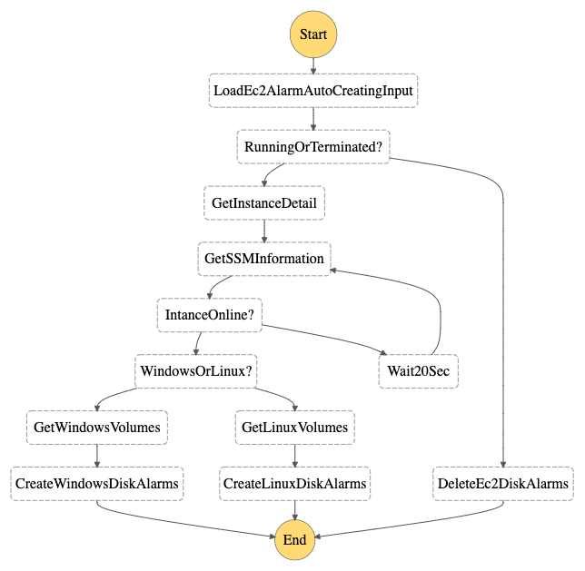

# AutoOps

This project contains useful operational processes represented as state machines with AWS StepFunctions. Currently, it is used for auto-creating EBS usage alarms when EC2 instances starts and auto-scaling up EBS volumes and file systems. Since only XFS and NTFS can be scaled up online, if the file systems on your EC2 instances are other than those, please be noted that only the EBS volumes will be scaled up automatically and the Step Functions will stop with error when trying to scale up file systems.

## How it works

The state machine to put disk alarms when EC2 instances go running.



The state mechine to scale EBS volume and its file systerm when disk alarm happenes.


## How to deploy

0. Prerequisites

    - For running SSM command, you need to install SSM Agent in your EC2 instances. Please refet to [https://docs.aws.amazon.com/systems-manager/latest/userguide/ssm-agent.html]

    - For monitoring the disk usage, you need to install and config CloudWatch agent in your EC2 instances. Please refer to [https://docs.aws.amazon.com/AmazonCloudWatch/latest/monitoring/Install-CloudWatch-Agent.html]

1. With SAM CLI installed
    ```
    # sam build
    # sam deploy --guided
    ```
2. Without SAM CLI, use CloudFormation template directly
    - Create a S3 bucket and prefix "AutoOps"
    - Upload the files in artifacts/ to s3://bucket-name/AutoOps. You need to replace "bucket-name" with your own S3 bucket name in following commands.
    ```
    # aws s3 sync ./artifacts s3://bucket-name/AutoOps
    ```
    - Modify the CloudFormation template packaged.yaml
        - Linux:
        ```
        # sed -i 's/<your S3 bucket>/bucket-name/g' packaged.yaml
        ```
        - MacOS:
        ```
        # sed -i '' 's/<your S3 bucket>/bucket-name/g' packaged.yaml
        ```
    - Run CloudFormation with packaged.yaml, the outputs of CloudFormation includes:
        1. EC2 disk alarm auto-creating state machine ARN
        2. EBS auto-scaling state machine ARN
        3. APIGateway Endpoint to start start machines' execution

## Test by API invokation

A private API was created so you can start execution of state machines by REST requests. If you want to do this, please create a VPC endpoint to Api Gateway service and modify the Resource Policy of the API to allow your VPC to invoke. 

**Please be noted that you should apply other security service such as IAM authorization to protect this API.**

1. EC2 disk arlam auto-creating
    ```
    # curl <APIGateway Endpoint>/ec2_alarm_create -X POST -d '{"input": "{\"detail-type\": \"EC2 Instance State-change Notification\", \"source\": \"aws.ec2\", \"detail\": {\"instance-id\": \"<Your EC2 Instance ID for test>\", \"state\": \"running\"}}","stateMachineArn": "<EC2 disk alarm auto-creating state machine ARN>"}'
    ```

    For Linux instance, CloudWatch event rules will be created for each ebs attached to this instance. The alarm threshold is 80% be default. If you want to change the threshold, please update Environment of Lambda function CreateLinuxDiskAlarms.

    For Windows instance, CloudWatch event rules will be created for each ebs attached to this instance. The alarm threshold is 20% be default. If you want to change the threshold, please update Environment of Lambda function CreateWindowsDiskAlarms.

2. EBS auto-scaling on Linux

    ```
    # curl <APIGateway Endpoint>/ebs_scale -X POST -d '{"input": "{\"detail-type\": \"CloudWatch Alarm State Change\",\"source\": \"aws.cloudwatch\",\"detail\": {\"alarmName\": \"DiskSpace\",\"state\": {\"value\": \"ALARM\"},\"configuration\": {\"metrics\": [{\"metricStat\": {\"metric\": {\"namespace\": \"CWAgent\",\"name\": \"disk_used_percent\",\"dimensions\": {\"path\": \"<The mount point of device>\",\"InstanceId\": \"<Your EC2 Instance ID for test>\",\"device\": \"<The device name in OS>\",\"fstype\": \"xfs\"}}}}]}}}","stateMachineArn": "<EBS auto-scaling state machine ARN>"}'
    ```

3. EBS auto-scaling on Windows

    ```
    # curl <APIGateway Endpoint>/ebs_scale -X POST -d '{"input": "{\"detail-type\": \"CloudWatch Alarm State Change\",\"source\": \"aws.cloudwatch\",\"detail\": {\"alarmName\": \"DiskSpace\",\"state\": {\"value\": \"ALARM\"},\"configuration\": {\"metrics\": [{\"metricStat\": {\"metric\": {\"namespace\": \"CWAgent\",\"name\": \"LogicalDisk % Free Space\",\"dimensions\": {\"instance\": \"<The Drive Letter>:\",\"InstanceId\": \"<Your EC2 Instance ID for test>\"}}}}]}}}","stateMachineArn": "<EBS auto-scaling state machine ARN>"}'
    ```

